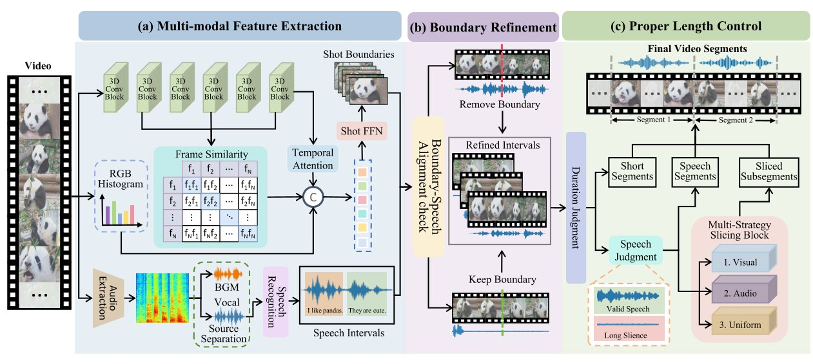

# Speech-Aware Multimodal Video Slicing for Automated Video Trimming

## 💡Method



## 🛠 Data Preparation

```
data
├── caption
├── output
│   ├── caption
│   ├── evaluation
│   └── story
├── section_data
└── video
│	├── video_001
│	│   └── 001.mp4
│	├── video_002
│	│   └── 002.mp4
│         ...
```
  
## 🚀 How to start

To get started, you need to import your API key into the project. 

```bash
export GPT_API_KEY='your_gpt-4o_api_key'
export BASE_URL='your_base_url'
export DASHSCOPE_API_KEY='your_dashscope_api_key'
```

#### Video Slicing

1. You need to modify the folder paths and corresponding sections in the configuration files before executing the program:

   ```bash
   python slicing/main.py
   ```

2. Convert the output json files to the specified format:

   ```bash
   python tools/transform.py  
   ```

   The output path can be set to `./data/section_data`

3. Organize the processed json files into appropriate directories:

   ```bash
   python tools/mkdir_move.py
   ```

#### Video Structuring

```bash
python tools/get_caption.py --config data/get_caption.yaml
```

This command would generate `./data/caption`.

#### Story Composition

```bash
python tools/get_story.py --config data/get_story.yaml
```

This command would generate `./data/output/caption` and `./data/output/story`.

#### Output Video

```bash
python tools/get_video.py --config data/get_video.yaml
```

This command would generate `./data/output/story/*/output_video.mp4`.

#### Video Evaluation

```bash
python tools/get_evaluation.py --config data/get_evaluation.yaml
```

This command would generate `./data/output/evaluation`.

